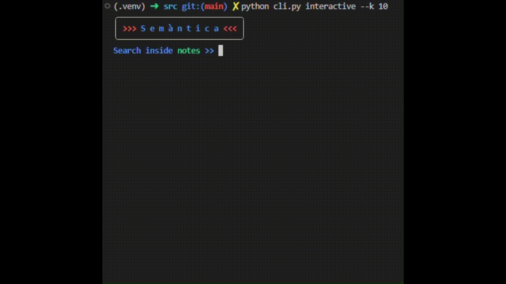

# Semàntica

Semantic search (FAISS) for markdown notes.

> "Probably an overkill"

## 🚀 Features

- **Similarity search** over a folder of markdown files.
- **Supports for in-note YAML metadata** - As used in [Obsidian.md](htps://obsidian.md).
- **Beautifil CLI**.
- **Choose your embedding model** (default: `all-MiniLM-L6-v2`).  

## 📌 Installation

Dependencies

- `python 3.8+`
- `pip 22.0+`

### Clone the repository

```bash
git clone https://github.com/aleloprete/semantica.git
cd markdown-search-cli
```

### Install dependencies

```bash
pip install -r requirements.txt
```

## Usage

### Import Notes

Import your markdown files in `./notes`.

### Build the Index

Before searching, you need to index your notes. This processes all .md files in the ./notes folder and builds a FAISS index.

```bash
cd src
python cli.py index --folder ../notes
```

### Interactive Search



Launch an interactive search session. Sets `--k` to the number of files to be shown.

```bash
python cli.py interactive --k 10
``` 

## Configuration

> Work In Progress

Current config in `src/config.py`.

## Troubleshooting

- Make sure FAISS is installed correctly:

```bash
pip install faiss-cpu
```

- Ensure the index command has been run before searching.

```bash
python cli.py index --folder ./notes
```

- Make sure you have installed the requirements.

```bash
pip install -r requirements.txt
```

# ⚖️ License

This project is licensed under the MIT License. See the full license at [LICENSE](./LICENSE).

# Star This Project!

If you find this project useful, please consider starring ⭐ it on GitHub!

# To Do

- [ ] Check consistency of CLI parameters/global config.
- [ ] Check YAML parsing.
- [ ] Add support for pdf.
- [ ] Faster search somehow