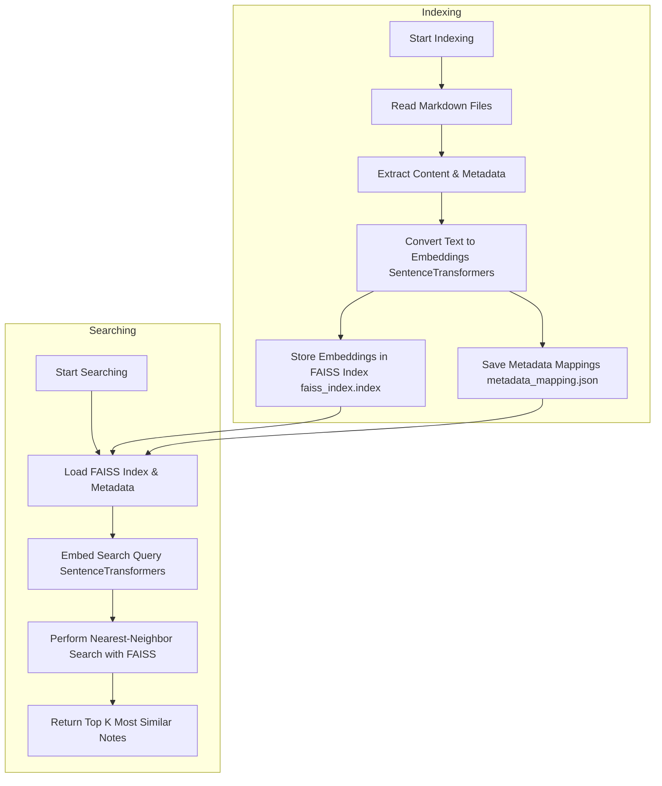

# Technical Notes

### Indexing `indexer.py`

- Reads all .md files from the target folder.
- Extracts content and optional YAML metadata.
- Converts text into embeddings using SentenceTransformers.
- Stores embeddings in a FAISS index (faiss_index.index).
- Saves metadata mappings (metadata_mapping.json).

### Searching `searcher.py`

- Loads the FAISS index and metadata.
- Embeds the search query.
- Performs nearest-neighbor search using FAISS.
- Returns the top K most similar notes.

## 📚 Dependencies

Package	Purpose

- `faiss-cpu`	Efficient vector search engine
- `sentence-transformers`	Generates embeddings from markdown text
- `typer`	Elegant command-line interface
- `rich` Beautiful CLI output
- `pyyaml`	Parses YAML metadata from markdown notes

